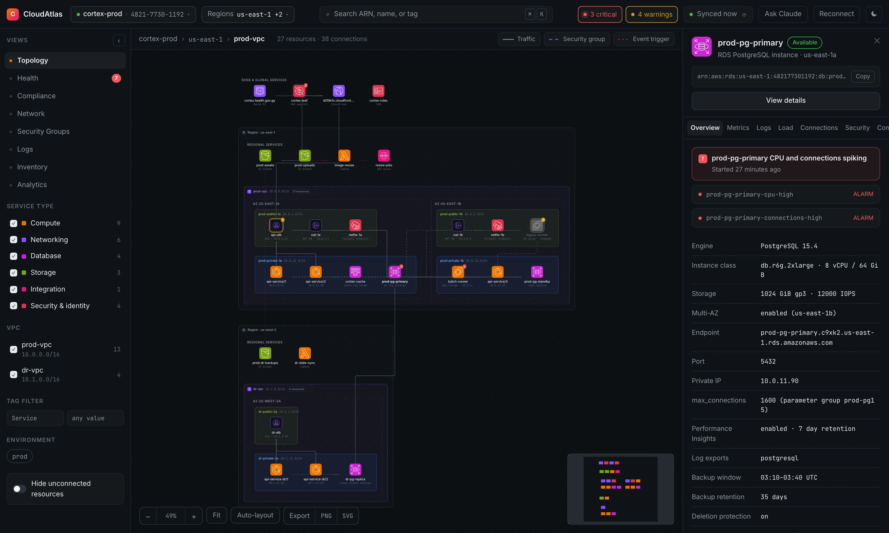
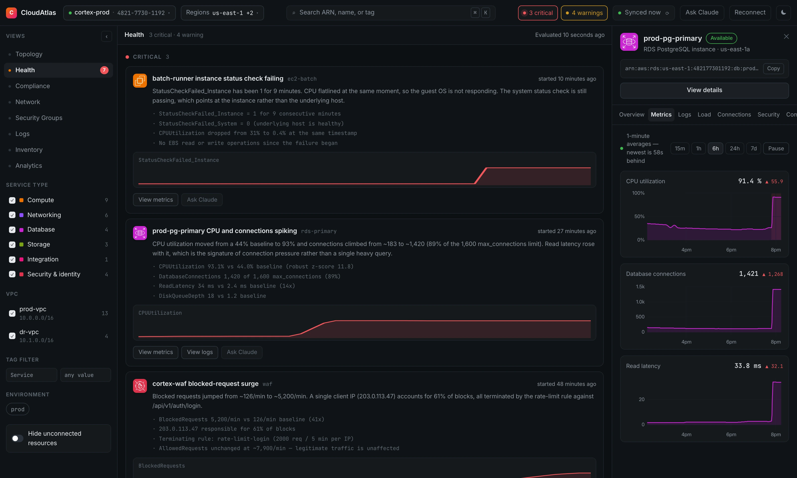
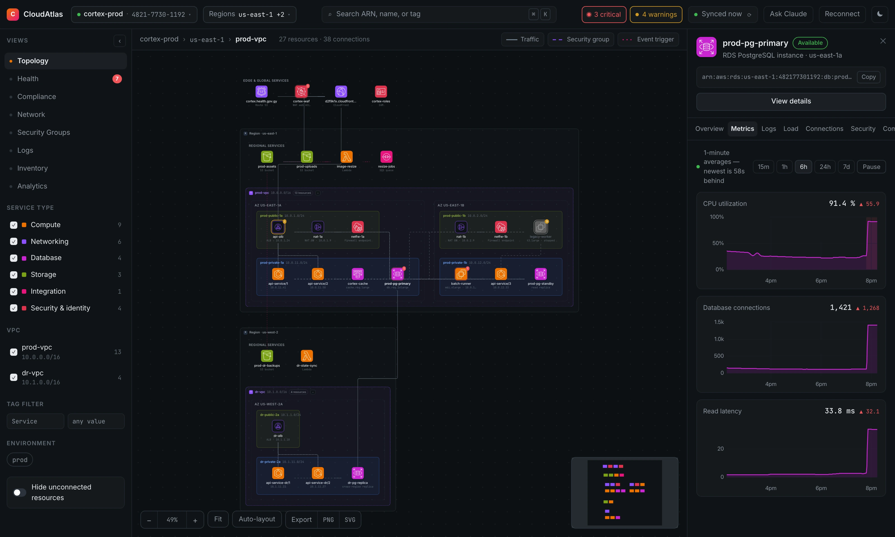
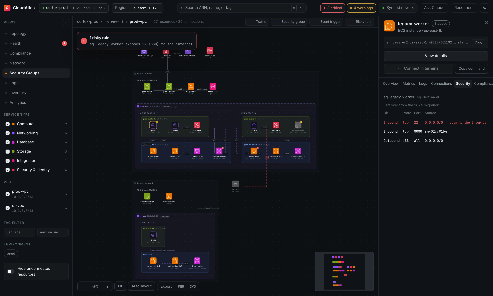
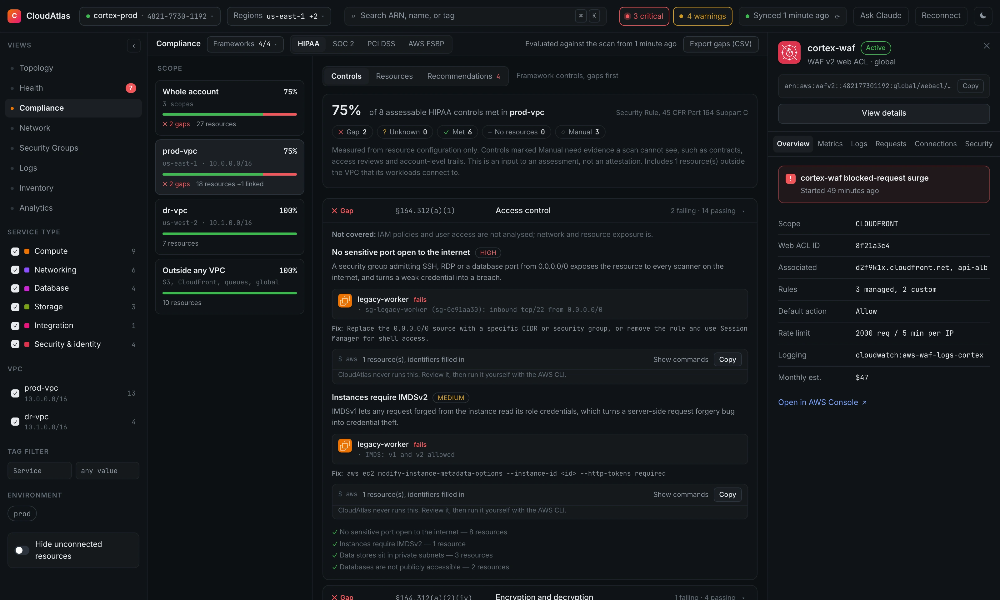
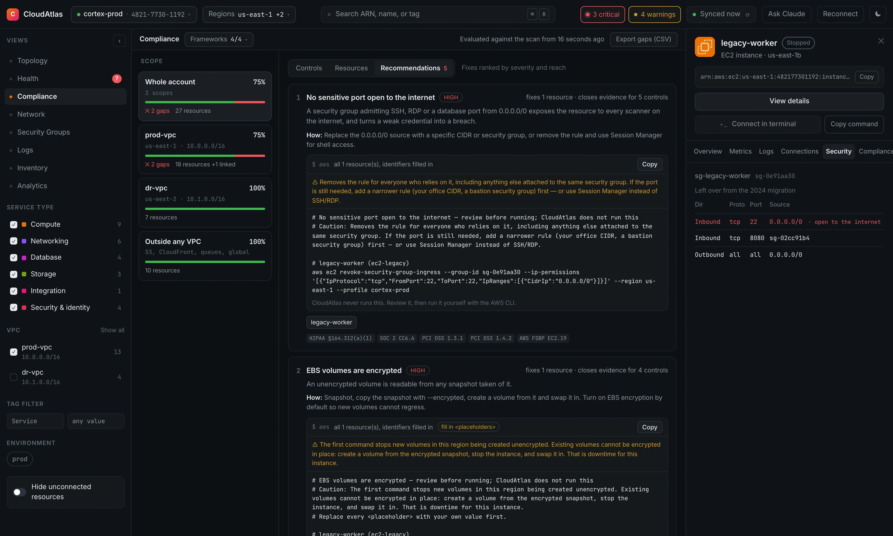
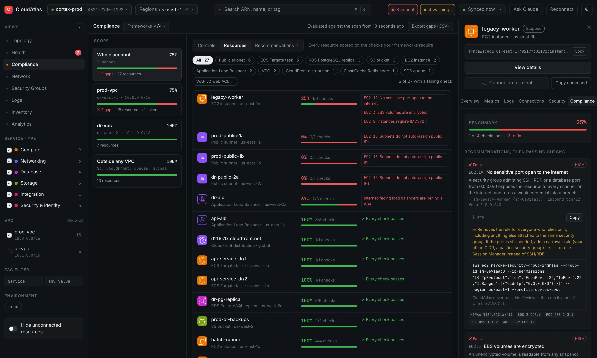
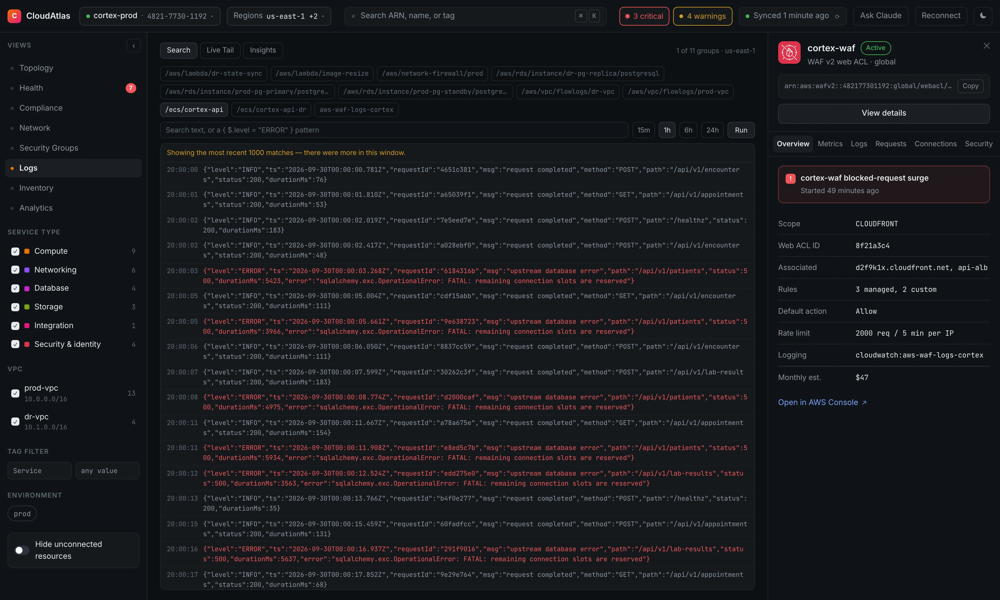
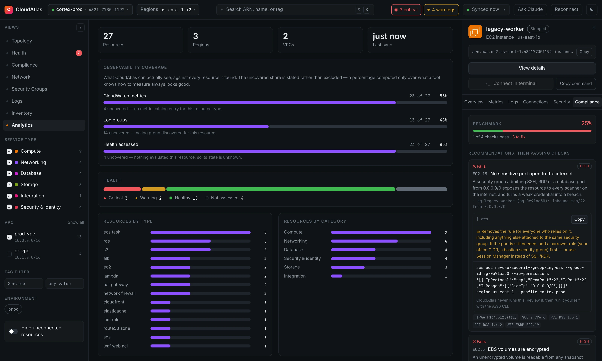

# CloudAtlas

A local web app that scans an AWS account with your existing CLI credentials and renders a live,
explorable architecture diagram — with metrics, logs, health detection, compliance checks and a
Claude agent for troubleshooting.

Everything runs on your machine. Credentials are never sent to the browser, and the code never calls
a mutating AWS API.



---

## What it does

- **Maps the account.** Regions, VPCs, availability zones and subnets render as nested containers
  holding EC2, ECS, Lambda, load balancers, RDS, ElastiCache, S3, SQS, CloudFront, Route 53, WAF,
  Network Firewall and IAM roles. Edges show traffic, security-group relationships, event triggers
  and risky exposure to the internet.
- **Shows health.** CloudWatch metrics stream live. Findings cover anomalous metric spikes, WAF
  surges, firing alarms and failed status checks, plus risky configuration: public databases, SSH
  open to the world, IMDSv1 and unencrypted storage.
- **Searches logs.** Log group discovery, filter search, Logs Insights and live tail, tied to the
  resource you are looking at.
- **Measures compliance.** Every VPC and its resources are checked against HIPAA, SOC 2, PCI DSS and
  AWS Foundational Security Best Practices — see [Compliance](#compliance).
- **Breaks down cost.** Actual spend from Cost Explorer, an estimated run-rate per resource and VPC
  from AWS list prices, and savings with copy-paste fixes — see [Cost](#cost).
- **Answers questions.** A Claude agent with read-only tools answers questions such as "why is the
  database slow?" or "what is blocking prod-vpc for SOC 2?" from the scanned data.
- **And the rest:** inventory and analytics views, a full-page view per resource, ⌘K search,
  diagram export, and a Session Manager terminal launcher for EC2.

Three guarantees hold throughout:

- **Read-only by construction.** The AWS client refuses any operation not in a registry of
  read-only calls. Even compliance fixes are text for you to run — see [AWS access](#aws-access).
- **Honest about gaps.** A denied permission or an uncollected fact is shown as missing or unknown,
  never as healthy or compliant.
- **Local.** The server binds to `127.0.0.1` and rejects requests from any other origin.

---

## A tour

Every screenshot is from demo mode (`npm run dev:demo`), a fictional three-region account, so what
you see here is what you get before connecting AWS at all.

### Health

Live incidents and configuration findings, each with the evidence behind it. Here the demo's
staged incidents: a failed status check, an RDS CPU and connection spike, and a WAF surge.



### Metrics

CloudWatch metrics stream for the selected resource, with how far behind the newest datapoint is.



### Security groups

The Security Groups view draws security-group relationships and flags rules that expose a
sensitive port to the internet.



### Compliance

Each VPC measured against HIPAA, SOC 2, PCI DSS and AWS FSBP, gaps first, with the failing
resources and their evidence.



Recommendations rank the fixes and give copy-paste AWS CLI commands with the resource's own
identifiers filled in. CloudAtlas never runs them.



Every resource gets a benchmark score and its own fixes in the detail panel.



### Logs

Search, live tail and Logs Insights across a resource's log groups. Here the API's database
errors line up with the RDS incident above.



### Analytics

Coverage stated honestly: what CloudAtlas can see, against every resource it found.



---

## Quick start

```bash
npm install
npm run dev
```

Then open <http://127.0.0.1:5173>.

`npm run dev` starts two processes: the Fastify API on `127.0.0.1:5174` and the Vite dev server on
`127.0.0.1:5173`, which proxies `/api` to the backend.

### Demo mode

```bash
npm run dev:demo
```

Runs against a bundled fixture account — a three-region estate with a VPC, ALB, ECS tasks, RDS
primary/standby, ElastiCache, WAF, CloudFront, S3, Lambda, SQS and a legacy EC2 instance with SSH
open to the world. It also generates realistic time series with three injected incidents (an RDS
CPU/connection spike, a WAF blocked-request surge and an EC2 status-check failure), so every panel
has something real to show.

`npm run dev` defaults to the demo provider (`cloudatlas.config.json` sets it). Switch with
`npm run dev:live` once you have a profile ready; every feature works against a live account.

---

## Compliance

The **Compliance** view measures each VPC — and the resources outside it that its workloads connect
to, such as the bucket its tasks write to — against the frameworks you choose:

| Framework | What it covers |
| --------- | -------------- |
| HIPAA | Security Rule safeguards for ePHI (45 CFR Part 164 Subpart C) |
| SOC 2 | Trust Services Criteria for security, availability and confidentiality |
| PCI DSS v4.0.1 | Requirements for systems that handle cardholder data |
| AWS FSBP | The per-resource benchmark AWS Security Hub scores against (EC2.8, RDS.3, …) |

Pick which apply with **Frameworks** in the view header. The choice is saved per AWS account, and a
check none of the chosen frameworks require is dropped rather than reported as a gap.

It reads three ways:

- **Controls** — each framework control with its status, gaps first, and the failing resources
  with their evidence.
- **Resources** — every resource scored on the checks that apply to it, worst first.
- **Recommendations** — fixes ranked by severity and by how many resources they fix, each listing
  the controls it closes across all frameworks.

Every resource also has a **Compliance** tab in the detail panel, and **Export gaps (CSV)** writes
the gap list with citations, evidence and commands for a ticket or an auditor.

### Copy-paste fixes

Each failing resource comes with AWS CLI commands that fix it, with its identifiers, region and
profile filled in. **CloudAtlas never runs them** — it has no write access and its client refuses
any mutating call. You review the commands and run them yourself.

- Disruptive fixes carry a caution: downtime, cost, or who loses access.
- Where a value only you know is needed (a log bucket, a web ACL), the command keeps a visible
  `<placeholder>` and is marked as needing input, rather than guessing a value that would run and
  do the wrong thing.
- Fixes that cannot be done in place, such as encrypting an existing RDS instance, are given as the
  documented migration steps. A few, like leaving the default VPC, have no command and say so.

### What the score means

The score is met controls as a share of the controls a scan could decide. It is evidence for an
assessment, **not an attestation**:

- A fact the scan could not read is **unknown**, never a pass, and counts against the score.
- Controls a configuration scan cannot see — a BAA with AWS, MFA, CloudTrail, access reviews — are
  listed as **Manual** and kept out of the percentage, with a note on the evidence needed.
- Partly assessed controls say what is not covered. Known gaps today: ElastiCache subnet placement,
  load balancer access logs, TLS policy versions and KMS key rotation are not collected.

The checks live in `apps/server/src/compliance/`. They read the same fact vocabulary as the posture
detectors (`graph/posture-facts.ts`), so live scans, replayed fixtures and demo mode are evaluated
by the same code.

## Cost

The **Cost** view answers where the money goes and how to spend less, in three modes. Two different
numbers appear, and each mode says which one it shows:

| Mode | Source | What it can tell you |
| ---- | ------ | -------------------- |
| **Spend** | AWS Cost Explorer | What was billed: month to date, month-end forecast, last month, 30 days by day, by service and region |
| **Run-rate** | AWS Price List API | An estimate per resource and VPC: on-demand list price × what is running now |
| **Savings** | Scan + list prices | Changes that cost less, ranked by estimated monthly saving, with a risk level and AWS CLI commands |

Every service, region, VPC and resource type opens a drill-down: the billed figures where Cost
Explorer has them (with a service's own 30-day trend), the estimate for the resources the scan can
see, the savings found among them, and general ways to save on that service — labelled apart from
the findings. Resources open their full page, which now carries Cost and Compliance sections.

**Spend is the bill; run-rate is an estimate.** Cost Explorer includes every usage charge and
discount but only groups by service, region and day. The run-rate can say which database costs
what, but leaves out data transfer, requests and discounts. Usage-based services (Lambda, S3, SQS,
CloudFront) are listed as not estimated rather than guessed.

**Cost Explorer costs money**, $0.01 per request, so Spend is off until you press *Turn on Cost
Explorer* (or set `enableCostExplorer`). A refresh is four requests, cached for 12 hours in
`data/cost.json`, and a manual refresh is limited to once every 10 minutes. The Price List API is
free.

Savings checks: unattached EBS volumes, storage on stopped instances, gp2 → gp3 (EC2 and RDS),
previous-generation instance types, Graviton equivalents, load balancers with no targets, extra NAT
gateways and Multi-AZ databases in resources tagged non-production, and x86 Lambda functions. The
total counts only the largest saving per resource, so overlapping suggestions never promise money
twice. As with compliance fixes, CloudAtlas never runs the commands.

## Capturing a fixture

CloudAtlas is developed against recorded fixtures, not a live account. `npm run capture` runs the
real collectors once, redacts the transcript, checks the result, and only then writes anything:

```bash
cp capture.deny.example.json capture.deny.json   # add your org's real names
npm run capture -- --profile sandbox --region us-east-1 --out fixtures/capture-01
```

### Two gates, and why both exist

**The deny-word check** is the one that decides whether a fixture may be written. Redaction is a
blocklist — anything matching no known pattern passes through verbatim — so after redacting, the
capture scans the serialised output for strings that must not appear in it: case-insensitive,
substring, every file, every nested value, keys included. Your account id (with and without dashes)
and the profile name are added automatically; `capture.deny.json` (gitignored) holds your org names.

On a hit it prints the file, the JSON path and a masked excerpt, writes **nothing**, and exits
non-zero. There is no window in which unredacted data sits on disk. `manifest.json` and `meta.json`
go through the same scan as the transcript files — they are generated after collection, so they must.

**Replay verification** then proves the fixture still builds the same graph, node for node and edge
for edge. Redaction that breaks a cross-reference is as bad as redaction that misses a secret.

### What the redactor handles

Account ids, resource ids, public IPv4 and IPv6, DNS names and custom domains, S3 bucket names,
Route 53 zone and record names, IAM role / instance profile / KMS alias names, log group names,
security group rule descriptions and other free text, AMI names and descriptions, DB and cluster
identifiers, pagination tokens, and task-definition environment variable **names and values**.

Recorded `AccessDenied` errors get the hardest treatment. AWS phrases them as *"User: &lt;principal
ARN&gt; is not authorized to perform: &lt;action&gt; on resource: &lt;resource ARN&gt;"*, so a single
string carries the caller's role name, SSO session name and often their email, plus the target's
name. Principal paths, emails and AROA-style ids are stripped everywhere; inside an error message
every ARN tail is flattened too. The action and the `role/` vs `user/` marker survive, because the
missing-permission notice needs them.

It runs in two passes. Pass one *learns* every identifying name; pass two replaces those literals
everywhere, including inside ARNs. Without that, redacting `LoadBalancerName: "api-alb"` still
leaves `api-alb` sitting in `arn:...:loadbalancer/app/api-alb/50dc6c49`.

Replacements are assigned in encounter order, never derived from the original value — a hash of a
12-digit account id is brute-forceable. The mapping never touches disk.

**Before adding a pattern**, read the comment block at the top of `apps/server/src/aws/redact.ts`.
A pattern matching a *shape* rather than a *position* will eventually collide with another format
sharing that shape, and a stricter validator cannot resolve it, because the colliding text is
usually genuinely valid in its own format. That block records how this bit: the IPv6 matcher once
rewrote `arn:aws:sts::<account>:` into `arn:aws:sts2001:db8::…`, and neither replay verification nor
the deny gate noticed.

Preserved on purpose: private CIDRs, ports, states, instance types, engine versions, AZ and region
names — and `0.0.0.0/0` and `::/0` **exactly**, because rewriting them would silently destroy the
risky-rule findings the fixture exists to exercise. That invariant has its own tests.

### Tags

Tag keys are always kept; values are redacted except for `Name`, which stays so fixtures remain
readable. `--keep-tag Environment` keeps more. `--keep-no-tags` redacts everything including `Name`
— use it for a client account. Whatever is kept is echoed loudly in the summary, because a kept tag
value is committed verbatim.

### Auditing a capture before you commit it

```bash
npm run capture:audit fixtures/capture-01
```

Two sections, in order of risk. First **every recorded error string in full** —
an `AccessDenied` message is the densest PII in the corpus (principal ARN, SSO role, session name
and often an email, in one string), so these are printed to be read rather than skimmed. Second the
**unique string set**, the equivalent of `jq -r '.. | strings' | sort -u`.

The gate proves the absence of words you thought of. The unique set is how you find the class nobody
thought of. Both bugs found during hardening were of exactly that kind.

### Comparing two captures

```bash
npm run capture:diff fixtures/capture-01 fixtures/capture-02
```

Two captures of the same account minutes apart should produce identical graphs except for whatever a
narrowed policy removed. Anything else is nondeterminism or real drift, and the difference matters
before a fixture is pinned.

The tool separates them. It first **replays each capture twice and compares the results against
itself** — a capture cannot drift against itself, so any difference there is nondeterminism in the
collectors or builders, and it stops rather than continuing. Only then does it cross-diff, attributing
every removal to the permission that would have produced it. What is left in the `unexplained`
section is account drift or a bug, and is the only part that should need thinking about.

Nodes are matched on **structural identity**, not on their redacted ids. Redaction numbers its fakes
in encounter order, so a denied call that shortens the sequence renumbers everything after it —
matching on id would report the whole estate as removed and re-added. Instead a node is identified by
what redaction preserves (private CIDRs and IPs, AZ names, ports, engine versions, instance types)
plus its parent's fingerprint.

Differences land in four buckets, because they demand different reactions:

| Bucket | Meaning | Fatal |
| --- | --- | --- |
| `id-shifted` | Same resource, new fake id | no |
| runtime | Matched resource, moment-in-time state moved | no |
| structural | Shape changed, or a resource added/removed | **yes** |
| ambiguous | Two candidates equally good | **yes** |

Ambiguity is refused rather than guessed: a wrong pairing would invent a changed field that never
changed and send you chasing it. Redaction artefacts are *normalised* rather than excluded, so
`vol-0000000001 80 GiB` → `vol-0000000091 80 GiB` is a shift while `… 80 GiB` → `… 120 GiB` is still
drift. `scannedAt` is excluded outright.

### When a failure is not recognised

AWS's phrasing for a permission denial is not a closed set, and services disagree — EC2 raises
`UnauthorizedOperation`, ECS `AccessDeniedException`, the Query-protocol services carry it in `Code`
under a generic exception name. Rather than chase the next variant, any AWS failure matching no
classifier is recorded as **unclassified** with its service, operation, error name and code, listed
in `meta.json` and printed by the capture and the audit tool.

It costs one call's data, not the region. A bug in CloudAtlas's own code is deliberately *not*
filed this way — it stays unwrapped and fails the region loudly, so it can't hide as an interesting
AWS quirk.

### Telemetry

`meta.json` records per-region wall clock, API time, call counts broken down by operation, retries,
throttles and resource counts, plus the measured rate projected against the 500-resource / 60-second
target. The summary prints the same table.

---

## Commands

| Command             | What it does                                             |
| ------------------- | -------------------------------------------------------- |
| `npm run dev`       | API + web, hot reloading both                            |
| `npm run dev:demo`  | Same, forced onto the fixture provider                   |
| `npm run dev:live`  | Same, forced onto the real-AWS provider                  |
| `npm run build`     | Type-checks and builds the web app to `apps/web/dist`    |
| `npm run e2e`       | Playwright end-to-end tests against demo mode            |
| `npm run typecheck` | `tsc` across all three workspaces                        |
| `npm test`          | `check:iam` then the Vitest suite                         |
| `npm run check:iam` | Fail if the registry has unused entries or the policy drifted |
| `npm run capture`   | Record a redacted AWS fixture (see above)                  |
| `npm run iam-policy`| Regenerate `docs/iam-policy.json` from the call registry |
| `npm run icons`     | Refresh the AWS Architecture Icons                       |

---

## Configuration

### `.env` (gitignored)

Copy `.env.example` to `.env`. Only the Claude agent needs anything here; the rest of the app works
without it.

| Variable            | Default            | Purpose                                     |
| ------------------- | ------------------ | ------------------------------------------- |
| `ANTHROPIC_API_KEY` | —                  | Enables the agent panel (Milestone 5)       |
| `CLOUDATLAS_MODEL`  | `claude-sonnet-5`  | Model used by the agent loop                |
| `CLOUDATLAS_PROVIDER` | from config file | `live` or `demo`                            |
| `CLOUDATLAS_PORT`   | `5174`             | Local API port                              |
| `CLOUDATLAS_LOG_LEVEL` | `info`          | pino level                                  |

### `cloudatlas.config.json`

Thresholds and feature flags: default regions, health poll interval, anomaly detection settings
(robust z-score, baseline window, per-metric absolute floors, WAF surge multiple) and
`enableCostExplorer`, which is off because Cost Explorer bills per request.

---

## AWS access

CloudAtlas uses the AWS SDK's default credential chain with a selectable profile, so SSO profiles
work as-is (`aws sso login --profile <name>` first). Profile **names** are read from `~/.aws/config`
and `~/.aws/credentials`; CloudAtlas never reads access keys out of them or forwards them.

### No profile on the machine

If no profile exists, the first-run screen asks for an access key ID, secret and (for temporary
`ASIA…` keys) session token. The local server checks them with `sts:GetCallerIdentity` and, only if
AWS accepts them, appends them to `~/.aws/credentials` as a named profile (default `cloudatlas`, file
mode `0600`) with its region in `~/.aws/config` — exactly what `aws configure` would write. From then
on it is an ordinary profile, so the CLI fix commands and **Connect in terminal** work with it too.

The keys are never sent back to the browser, logged, or stored anywhere else, and an existing
profile is never overwritten. Use keys for an IAM user with read-only access; `docs/iam-policy.json`
lists every action CloudAtlas calls. To remove them, delete the profile's section from
`~/.aws/credentials` and `~/.aws/config`.

Read-only is enforced in one place. `apps/server/src/aws/client.ts` refuses any call that fails
**either** check: the operation name must read as read-only, **and** it must be registered in
`apps/server/src/aws/operations.ts` with status `active`. Both, not either — a prefix list alone
would allow a `Describe` on a service we never meant to touch, and a registry alone would let a
typo'd mutating name through review.

`docs/iam-policy.json` is generated from that same registry by `npm run iam-policy`, and
`npm run check:iam` (wired into `npm test`) enforces it in both directions: a call site with no
registry entry fails at runtime, and **a registry entry with no call site fails the check**. Unused
entries are how an IAM policy quietly widens over time, so every action in the committed policy has
to be justified by a line of code that calls it. Running that check for the first time removed two.

See `docs/iam-policy.md` for every action, why it is called, and which milestone introduced it.

The managed `ReadOnlyAccess` policy is enough to get started, with one confirmed gap:
`logs:StartLiveTail` is not granted by it, so live tail needs the scoped policy. When an API returns
`AccessDenied`, the collector records it, the scan continues, and the affected panel shows a
"missing permission" notice. A partial diagram beats no diagram.

### Connecting to an instance

**Connect in terminal** on an EC2 instance opens your own terminal (the default `.command` handler
on macOS, `start` on Windows, `$TERMINAL` or the first known emulator on Linux) running
`aws ssm start-session --target <id> --profile <p> --region <r>`. **Copy command** puts the same
line on your clipboard instead.

This does not weaken the read-only guarantee. CloudAtlas makes no AWS call: the session is started
by your AWS CLI, in a window you can see, exactly as if you had pasted the command. The server
takes only a node ID from the browser, resolves the instance and region from the scanned graph,
checks the profile against the ones it listed, and validates every token against a strict pattern
before it reaches a shell. You need the AWS CLI and the Session Manager plugin installed. There is
still no in-browser shell.

---

## Architecture

```
packages/shared/     TypeScript types + zod schemas shared by both sides
apps/server/
  aws/               read-only guard, operation registry, capture/replay transcript, redactor
  collectors/        one file per service; pure fetching, no interpretation
  graph/             relationship builders, SG risk analysis, console deep links
  health/            posture detectors, spike and WAF surge detection
  compliance/        checks, framework mappings, CLI fix generation
  agent/             Claude agent loop and its read-only tools
  scan/              per-region orchestration with a concurrency limit
  db/                node:sqlite behind a repository interface
  capture/           the `npm run capture` CLI
  providers/live/    real AWS provider
  providers/demo/    fixture provider with the same interface
  routes/            REST + SSE endpoints
apps/web/
  stores/            Pinia: app shell, graph + filters, health, compliance
  layout/            ELK layered/rectpacking layout, run in a Web Worker
  components/        top bar, sidebar, canvas, detail panel, views
```

**The provider interface is the only seam between the app and AWS.** Live and demo both implement
`scan`, `getMetrics`, `queryLogs`, `tailLogs`, `getFindings`, `getAlarms` and `getWafSampled`, so
demo mode exercises the same routes, the same graph analysis and (later) the same agent tools.

### Local-only, but not unauthenticated-by-accident

The server binds to `127.0.0.1` and rejects any request whose `Host` or `Origin` is not localhost.
That closes the DNS-rebinding path, where a page on a remote origin resolves its own hostname to
`127.0.0.1` to reach a local service.

### Icons

The canvas renders the official **AWS Architecture Icons** (release `07312026`). 25 SVGs live in
`apps/web/public/aws-icons/`, mapped to node types by `apps/web/src/lib/aws-icons.generated.ts`.

AWS ships a new pack quarterly (end of January, April and July). To update:

```bash
npm run icons                                   # pinned release
npm run icons -- --url <new quarterly zip url>  # when the pinned URL rotates
```

Get the current URL from <https://aws.amazon.com/architecture/icons/>. The script copies only the
icons CloudAtlas maps, regenerates the TypeScript map and writes `ATTRIBUTION.md`. If AWS renames a
file, the script says which mapping broke instead of failing silently.

Two icon styles are handled differently, following AWS's own diagram convention: *service* icons are
filled product tiles and drop straight onto the canvas, while *resource* icons are single-colour
line art and sit on a panel tile outlined in the category colour. A node type with no mapped icon
falls back to the design's abbreviation tile, as does any icon that fails to load.

Category colours come from the official palette, which matches the design's `CAT` block except for
`database` — the design used the older blue `#3B82F6`, whereas AWS's current Databases category (and
so every RDS and ElastiCache icon) is magenta `#C925D1`. The palette follows the icons so the
sidebar swatches, edge tints and tiles agree.

The icons are AWS trademarks, redistributed unmodified for diagram rendering. See
`apps/web/public/aws-icons/ATTRIBUTION.md`.

### Layout

The diagram is Vue Flow with compound nodes for Region → VPC → AZ → Subnet. ELK runs in a Web
Worker via `elk-api` plus an explicit `workerFactory`. Each container level gets its own
`rectpacking` aspect ratio, which is what produces AZ columns side by side with the public subnet
above the private one — a layered layout falls back to connected-component packing for the
edge-free container hierarchy and stacks everything vertically instead.

---

## Milestone status

| Milestone | Status |
| --------- | ------ |
| 1 · Skeleton + demo mode | **Done** |
| 2 · Live scan (collectors, SQLite cache, capture tooling) | **Done** |
| 3 · Metrics + health (uPlot, alarms, spike detection) | **Done** |
| 4 · Logs (drawer, live tail, Insights) | **Done** |
| 5 · Claude agent | **Done** |
| 6 · Polish (⌘K, export, IAM doc, Playwright) | **Done** |
| Compliance (HIPAA, SOC 2, PCI DSS, AWS FSBP, CLI fixes) | **Done** |

Unbuilt areas say so in the UI rather than rendering empty panels that look like healthy results.

---

## Notes

- `package.json` carries an `allowScripts` block. npm 11 gates package install scripts, and
  `esbuild`, `vue-demi` and `fsevents` need theirs to run for the toolchain to work. If npm
  upgrades one of those, run `npm install-scripts approve <name>` once.
- Requires **Node 24+**, because persistence uses the built-in `node:sqlite` rather than a native
  module. That is a deliberate trade: the cache is small and the queries trivial, so it is not worth
  a build step that breaks on a new Node major. `apps/server/src/db/types.ts` is the seam — swapping
  in `better-sqlite3` is a one-file change.
- The visual reference is `design/CloudAtlas.dc.html`. Its runtime (`support.js`, a React-based
  `x-dc` template engine) is not shipped — the UI is re-implemented in Vue.
